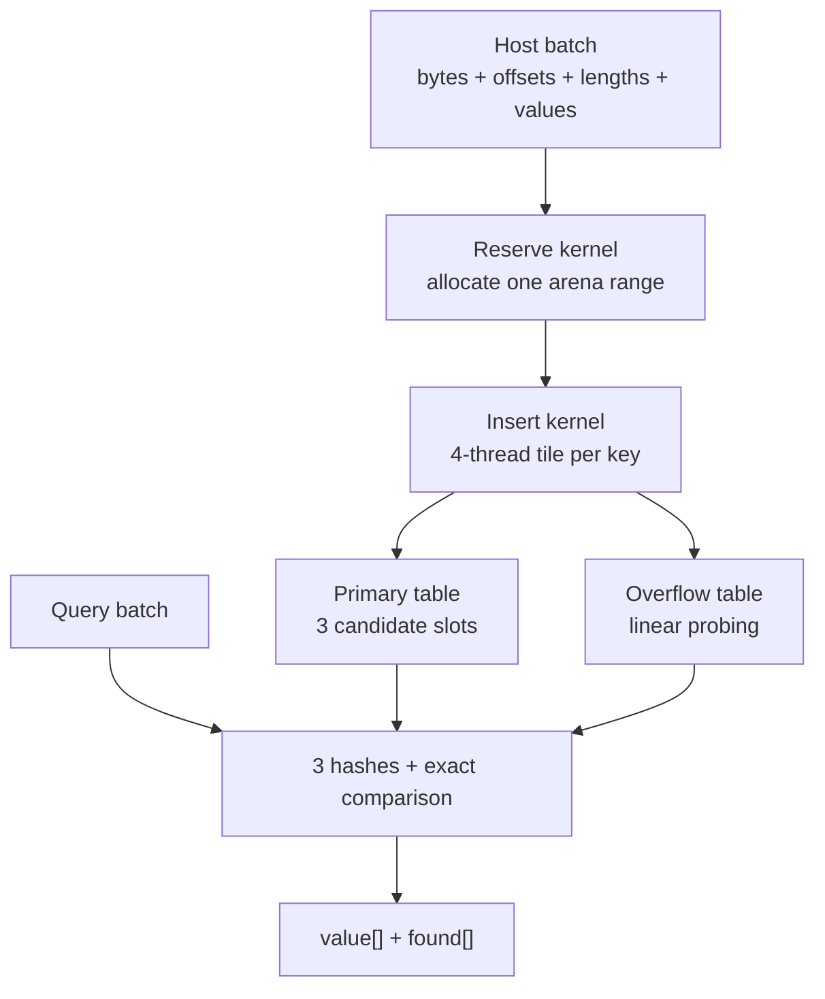

# GPU HashMap Engine

A CUDA prototype for batched associative operations on variable-length byte
keys, implemented in a deliberately procedural C style. Four threads cooperate
on each key, compute three independently seeded XXH32 hashes from the same input
loads, attempt three primary slots, and fall back to a linear-probed overflow
table. Hashes only select candidates: stored length and every key byte are
compared before a lookup succeeds.

The included file comparator is an end-to-end correctness harness for the map.
It is not a claim that hashing is the fastest way to compare two files.

> **Current status:** the earlier tree passed a native release build, the
> GPU/CPU XXH32 vectors, and the deterministic file matrix on an NVIDIA GeForce
> RTX 2070 SUPER (`sm_75`). The latest tree fixes an overflow-start mismatch,
> adds a forced-overflow lookup/deletion regression, and returns the host/tests
> to procedural C style. That complete tree still needs a target-machine rerun.
> Compute Sanitizer and reproducible performance characterization also remain
> pending.

## Engineering objective

This project started from a simple question: what changes when a hash table for
byte strings is designed around SIMT execution rather than copied from a CPU?

The implementation focuses on four coupled problems:

1. **Hashing** — expose useful parallel work inside each variable-length key.
2. **Indexing and storage** — keep table metadata compact and key bytes stable.
3. **Collision handling** — limit the common path to a few candidates without
   making collisions equivalent to key equality.
4. **Growth and lifetime** — make capacity failures explicit now, then add
   resizing and reclamation only after the fixed-capacity design is verified.

The current version is a correctness-first baseline for studying atomics,
memory traffic, divergence, register pressure, occupancy, and probe behavior.
It deliberately does not publish performance claims before those effects are
measured.

## Technical summary

| Property | Implementation |
| --- | --- |
| Key representation | Concatenated `uint8_t` arena plus `offset[]` and `length[]` |
| Value representation | Any `uint32_t`; presence is returned in a separate byte |
| Work assignment | One `cooperative_groups::thread_block_tile<4>` per key |
| Hash path | Three seeded XXH32 states computed in one traversal |
| Primary placement | Three direct candidates, each claimed with `atomicCAS` |
| Overflow path | Separate structure-of-arrays table with linear probing |
| Collision check | Stored length plus cooperative full-byte comparison |
| Deletion | Atomic live-offset-to-tombstone transition |
| Capacity | Fixed, explicit, workload-derived in the CLI |
| Host code | Plain structs/functions, C allocation and I/O, explicit CUDA cleanup |
| Target | Turing TU104, RTX 2070 Super, compute capability 7.5 |

This is **three-choice hashing with an overflow table**, not cuckoo hashing.
Insertion never evicts or relocates an existing entry.

### Implementation style

Project-owned host and test code intentionally avoids classes, inheritance,
templates, exceptions, iostreams, and STL containers. State lives in plain
structs; operations are free functions; ownership is visible through paired
`malloc`/`free` and `cudaMalloc`/`cudaFree` calls. The `.cu` files are still
compiled with `nvcc -std=c++17` because CUDA and the
`cooperative_groups::thread_block_tile<4>` API require C++ compilation. That
four-lane tile is the one deliberate use of a C++ template API in the kernel
path, not an object-oriented host design.

## System architecture



The map separates key storage from slot metadata:

```text
input batch
  bytes[]       concatenated key bytes
  offsets[i]    key i's start in bytes[]
  lengths[i]    key i's exact byte length
  values[i]     key i's 32-bit payload

device-resident map
  master_bytes[]        append-only key arena

  key_offsets[]         primary slot -> arena offset / sentinel
  key_lengths[]         primary slot -> key length
  values[]              primary slot -> payload

  overflow_offsets[]    overflow slot -> arena offset / sentinel
  overflow_lengths[]    overflow slot -> key length
  overflow_values[]     overflow slot -> payload
```

`HashmapEngine` is a device-resident descriptor containing capacities, arena
state, and pointers to those allocations. The host first creates the arrays
with `cudaMalloc`, places their device virtual addresses into a host-side
descriptor, and copies the descriptor itself to device memory.

The tables use a structure-of-arrays layout. Probing an offset does not
automatically fetch the corresponding value or length, and primary and overflow
metadata have the same representation.

### Slot-state encoding

The offset word doubles as the atomically updated slot state:

| Offset | Meaning |
| ---: | --- |
| `0xFFFFFFFF` | Empty: the probe sequence has never occupied this slot |
| `0xFFFFFFFE` | Tombstone: an entry was deleted here |
| `< 0xFFFFFFFE` | Live offset into `master_bytes` |

A separate `found[]` output means `0xFFFFFFFF` remains a valid user value.
Because two 32-bit offsets are reserved as sentinels, the arena must remain
smaller than `0xFFFFFFFE` bytes.

Ignoring allocation alignment and the descriptor itself, persistent storage is
approximately

```text
byte_capacity
  + 12 * primary_capacity
  + 12 * overflow_capacity
  + 4 bytes for failed_inserts
```

Key storage is append-only. Deletion changes table metadata but does not reclaim
arena bytes.

## Mapping XXH32 onto a four-thread tile

XXH32 processes a 16-byte stripe with four independent 32-bit accumulators. The
kernel maps that structure directly onto four lanes:

| Tile lane | Bytes in each stripe | Initial accumulator |
| ---: | --- | --- |
| `0` | `0..3` | `seed + PRIME1 + PRIME2` |
| `1` | `4..7` | `seed + PRIME2` |
| `2` | `8..11` | `seed` |
| `3` | `12..15` | `seed - PRIME1` |

Each lane loads one little-endian word and applies the XXH32 round:

```text
acc += word * PRIME2
acc  = rotl(acc, 13)
acc *= PRIME1
```

The implementation maintains three accumulator sets per lane:

```text
seed 0 = 0x9E3779B1
seed 1 = 0x517CC1B7
seed 2 = 0x85EBCA6B
```

One loaded word is therefore reused across all three seeded states. After all
complete stripes, every lane participates in `tile.shfl` operations that form
the standard XXH32 merge:

```text
rotl(v1, 1) + rotl(v2, 7) + rotl(v3, 12) + rotl(v4, 18)
```

Lane 0 owns the three merged states, handles the remaining 4-byte and 1-byte
tails, and executes the avalanche. Lookup and deletion broadcast lane 0's
results back across the tile before cooperative comparison.

### Alignment policy

Keys may begin at arbitrary byte offsets. `load_u32_le` therefore assembles a
32-bit word from four bytes instead of dereferencing an unaligned
`uint32_t*`. This preserves XXH32 semantics on every offset and creates a safe
baseline for a future aligned/vectorized fast path.

### Utilization tradeoff

A four-lane tile matches the 16-byte stripe well, but not every key length:

- A 256-thread block contains eight warps, 64 four-thread tiles, and therefore
  handles 64 keys per grid-stride iteration.
- Keys shorter than 16 bytes use the scalar XXH32 path in lane 0; lanes 1–3 do
  little useful work.
- Tail processing is serialized in lane 0.
- The file harness uses 20-byte keys: one cooperative 16-byte stripe followed
  by one scalar 4-byte tail.
- Insertion currently reads the input key once to copy it into the arena and
  again to hash it.

The project therefore treats “four threads per key” as a hypothesis to profile,
not a universal optimum. The relevant experiment is one versus two versus four
threads across real key-length distributions.

## Kernel work mapping

All map kernels require `blockDim.x % 4 == 0`. For each lane:

```cpp
global_thread = blockIdx.x * blockDim.x + threadIdx.x;
first_key     = global_thread / 4;
key_stride    = gridDim.x * blockDim.x / 4;
```

Integer division maps four consecutive threads to one key. The tile then uses a
grid-stride loop so the launch size is independent of the batch length.

The CLI uses 256 threads per block and computes

```text
blocks = max(1, min(ceil(4 * key_count / 256), 4 * SM_count))
```

The `4 * SM_count` term is only a grid-size heuristic. It is not an occupancy
calculation. On the 40-SM RTX 2070 Super it caps the launch at 160 blocks;
actual residency still depends on compiled register usage, shared memory, and
architectural block limits.

## Batched insertion

Insertion is intentionally split into two launches:

1. `reserve_batch_kernel<<<1,1>>>` validates capacity, publishes one
   `batch_base`, and advances the arena bump pointer.
2. `insert_kernel` copies keys into the reserved range, hashes them, and places
   their metadata.

This separation fixes a fundamental cross-block synchronization problem.
`__syncthreads()` is a block barrier; it cannot publish a value safely to an
arbitrary grid. Sequential kernel launches in the same stream give every insert
block a common, fully committed batch base.

For each key, lane 0 computes the primary candidates

```text
s1 = h1 % primary_capacity
s2 = h2 % primary_capacity
s3 = h3 % primary_capacity
```

and claims the first empty or tombstone slot with `atomicCAS`. If all three are
occupied, overflow probing starts at

```text
((h1 ^ h2 ^ h3) * 0x9E3779B9) % overflow_capacity
```

and scans at most the complete overflow capacity. Failed placement increments a
device counter; the host treats any non-zero count as an error instead of
silently dropping keys. Reserved arena space from a failed insertion is not
rolled back.

### Publication contract

The offset CAS is followed by non-atomic length and value stores. This is valid
under the current contract because insert, lookup, and delete kernels do not
overlap: the host orders them in one stream and synchronizes while checking each
launch. A concurrent-reader or multi-stream design would require an explicit
publication state or a release/acquire protocol.

Duplicate keys are not detected and update semantics are not defined. Insert
batches must currently contain unique keys.

## Lookup and collision correctness

A 32-bit hash is never accepted as proof of equality. For every primary or
overflow candidate:

1. Lane 0 reads the slot offset, stored length, and value.
2. Tile shuffles broadcast that metadata.
3. Empty and tombstone states are rejected before an arena dereference.
4. The stored range is validated against `master_byte_current`.
5. Stored and query lengths must match.
6. Lane `r` compares bytes `r, r+4, r+8, ...`.
7. `tile.any(different)` rejects the candidate if any lane finds a mismatch.

Lookup checks all three primary candidates. If none matches, it follows the
same overflow sequence used by insertion. A never-used slot terminates the
search; a tombstone does not.

Every query initializes its outputs:

```text
missing: found[i] = 0, results[i] = 0
matched: found[i] = 1, results[i] = stored_value
```

No payload value is overloaded as a not-found sentinel.

## Deletion

Deletion repeats the complete search and exact comparison, then atomically
replaces the live offset with the tombstone sentinel:

```text
atomicCAS(slot_offset, live_offset, 0xFFFFFFFE)
```

The distinction between empty and tombstone preserves overflow probe chains:

```text
EMPTY      -> nothing was ever inserted here; lookup may stop
TOMBSTONE  -> an entry existed here; lookup must continue
```

The current implementation does not compact clusters, reclaim bytes, or trigger
a rehash when tombstones accumulate.

## File-comparison harness

For a file of `S` bytes, the executable creates
`N = ceil(S / 16)` fixed-size 20-byte keys:

| Key bytes | Meaning |
| --- | --- |
| `0..3` | Little-endian 32-bit chunk index |
| `4..19` | Sixteen bytes of file data; the final chunk may be zero-padded |

The value associated with chunk `i` is also `i`.

Position is part of the key because inserting bare chunks would test unordered
membership. Reordered chunks, duplicate chunks, and multiplicity changes could
otherwise be misclassified.

The exact comparison procedure is:

1. Read both inputs in binary mode.
2. Reject different byte sizes before GPU work.
3. Return identical immediately for two empty files.
4. Insert file A's `(position || chunk, position)` pairs.
5. Query file B's positioned chunks.
6. Require `found[i] == 1 && results[i] == i` for every `i`.

Checking original file size before encoding makes zero padding in the last key
unambiguous. Even if XXH32 collides, the full 20-byte key comparison prevents a
false identical verdict.

The harness sizes the map as

```text
primary_capacity  = next_pow2(max(64, 2 * N))
overflow_capacity = next_pow2(max(64, floor(N / 4) + 1))
byte_capacity      = 20 * N
```

so the primary load target is at most 0.5 before the overflow reserve.

## Correctness invariants

| Invariant | Why it matters |
| --- | --- |
| Block size is divisible by four | Cooperative tiles and key indexing remain complete |
| `start <= total_bytes` and `length <= total_bytes - start` | Avoids overflow-prone `start + length` bounds checks |
| Arena offsets are below `0xFFFFFFFE` | Keeps live offsets distinct from both sentinels |
| Reservation completes before insertion | All blocks observe the same batch base |
| Mutation and lookup do not overlap | Length/value publication is visible before readers run |
| Overflow lookup uses insertion's complete probe sequence | Every successfully inserted overflow key remains reachable |
| Lookup stops only at `EMPTY`, never at `TOMBSTONE` | Deletion cannot sever a probe chain |
| Key length and bytes are checked | Hash collisions and prefix matches cannot become false hits |
| `found[]` is distinct from `results[]` | All `uint32_t` payloads remain representable |

The earlier prototype violated several of these conditions. The full audit and
the corresponding corrections are documented in
[docs/AUDIT.md](docs/AUDIT.md).

## Work and storage complexity

Let `L` be key length and `p` the number of overflow slots visited.

| Operation | Work per key | Qualification |
| --- | --- | --- |
| Hash | `O(L)` | Three seeded states share each 16-byte stripe load |
| Insert | `O(L + p)` plus at most three primary claims | Copying and hashing currently make separate input passes |
| Lookup | `O(L)` hash plus up to `O((3+p)L)` comparison | Occupied non-matching candidates can require a full key read |
| Delete | Lookup cost plus one successful CAS | Tombstones and arena bytes remain allocated |

The table stores neither the original hash nor a short fingerprint. A compact
fingerprint could reject most occupied non-matches before fetching key bytes,
but it would add metadata traffic and another publication field. That tradeoff
is intentionally left for measurement.

## CUDA compilation path

The implementation uses the CUDA Runtime API:

```text
application
  -> libcudart
  -> libcuda / user-mode driver
  -> NVIDIA kernel driver
  -> GPU command submission and execution
```

Device code follows the NVIDIA compilation pipeline:

```text
CUDA C++
  -> compiler/NVVM IR
  -> PTX virtual ISA
  -> ptxas
  -> sm_75 SASS
```

`hash3_xxh32` and its callers live in separate CUDA translation units. The build
therefore enables relocatable device code with `-rdc=true`, followed by device
linking. Release builds use `-O3 -lineinfo`; debug builds use `-O0 -g -G`.

PTX registers are virtual. Occupancy analysis must use the physical register
count reported after `ptxas`, together with shared-memory and block constraints.

Useful inspection commands:

```bash
cuobjdump --dump-resource-usage ./gpu-hashmap
cuobjdump --dump-ptx ./gpu-hashmap
cuobjdump --dump-sass ./gpu-hashmap
ncu --set full ./gpu-hashmap test/file_a.bin test/file_b.bin
```

## Build and run

Requirements:

- Linux
- NVIDIA GPU and compatible driver
- CUDA Toolkit with `nvcc`
- GNU Make
- Python 3 for generated test fixtures
- Compute Sanitizer and Nsight Compute for the corresponding targets

Build for the RTX 2070 Super:

```bash
git clone https://github.com/mxrse834/gpu-hashmap-engine.git
cd gpu-hashmap-engine

make CUDA_ARCH=sm_75
./gpu-hashmap path/to/file-a path/to/file-b
```

Override the architecture for another GPU:

```bash
make CUDA_ARCH=sm_86
```

The executable returns:

| Exit code | Meaning |
| ---: | --- |
| `0` | Files are byte-for-byte identical |
| `1` | Files differ |
| `2` | Invalid arguments, I/O/capacity failure, or a CUDA runtime/kernel error |

## Verification on `sm_75`

Run the release build, GPU/CPU hash vectors, and deterministic file matrix:

```bash
make clean
make test CUDA_ARCH=sm_75
```

Observed on the RTX 2070 Super before the forced-overflow regression was added:

```text
GPU/CPU XXH32 vectors: PASS

file_a.bin          vs file_b.bin          -> IDENTICAL
file_a.bin          vs file_c.bin          -> DIFFERENT
file_a.bin          vs file_reordered.bin  -> DIFFERENT
file_a.bin          vs file_d.bin          -> DIFFERENT (size mismatch)
empty_a.bin         vs empty_b.bin         -> IDENTICAL
```

The suite now also runs `hashmap-test`. It forces three keys into one overflow
cluster, verifies lookup from the raw-hash-derived start slot, deletes the first
key in that cluster, and verifies that later keys remain reachable through the
tombstone. Its expected terminal line is:

```text
forced-overflow lookup/delete: PASS
```

The hash test includes empty input, `a`, `abc`, concatenated keys with unaligned
starts, and the 15/16/17/65-byte boundaries under all three seeds. Before the GPU
comparison, the CPU implementation checks the published zero-seed XXH32 values
for empty input and `abc`.

The original compile command passed `-Wpedantic` through `nvcc`, which caused
GCC to warn on `#line` directives generated by CUDA and used throughout
`cooperative_groups.h`. The Makefile intentionally retains `-Wall -Wextra` but
does not apply that incompatible host policy flag.

### Sanitizer acceptance

```bash
make sanitize CUDA_ARCH=sm_75

compute-sanitizer --tool racecheck \
  ./gpu-hashmap test/file_a.bin test/file_b.bin

compute-sanitizer --tool initcheck \
  ./gpu-hashmap test/file_a.bin test/file_b.bin
```

The acceptance condition is zero project-originated invalid accesses, races,
uninitialized reads, leaks, or launch failures. These sanitizer passes are not
yet recorded as complete.

| Validation item | State |
| --- | --- |
| Native `nvcc` release build on RTX 2070 Super | Passed on earlier tree; latest tree pending rerun |
| GPU/CPU XXH32 differential vectors | Passed on earlier tree; latest tree pending rerun |
| Deterministic file-comparison matrix | Passed on earlier tree; latest tree pending rerun |
| Forced-overflow lookup/delete regression | Pending target rerun |
| Host-side syntax checks and fixture assertions | **Passed on latest tree** |
| Compute Sanitizer `memcheck` | Pending |
| Compute Sanitizer `racecheck` and `initcheck` | Pending |
| Reproducible Nsight Compute benchmark | Pending |

## Performance questions—not claims

The current implementation is designed to make the following measurements
possible. Any benchmark should record GPU, driver, CUDA version, build flags,
table capacities, load factor, key-length distribution, warm-up policy, and
whether timing covers kernels or the complete host/device path.

1. At what key lengths does a four-lane tile outperform one thread per key?
2. What physical register count results from three accumulator sets per lane,
   and how does it affect achieved occupancy?
3. What is the global-load cost of byte-safe word assembly relative to an
   aligned/vectorized path?
4. How much warp efficiency is lost when eight independent tiles in one warp
   take different primary and overflow paths?
5. How does atomic contention scale with primary-table load factor?
6. What is the overflow probe-length distribution, and which stall reasons
   dominate long chains?
7. For small batches, how much time is host I/O, allocation, transfer, and the
   deliberate post-launch synchronization rather than kernel execution?
8. Would a stored fingerprint save enough arena traffic to pay for its metadata?

The current kernel does not stage keys in shared memory. Each key is consumed by
one tile and is not reused across tiles, so staging would introduce a copy and a
barrier unless the algorithm is reorganized to create reuse. L1 behavior and
global-load efficiency should be measured with Nsight rather than assumed.

## Known limitations

- The procedural host allocation helpers are internal to `main.cu`; this is not
  yet a reusable C API.
- Duplicate-key insertion and update behavior are undefined.
- Capacity is fixed; there is no resize or rehash path.
- Arena storage and tombstones are never reclaimed.
- Insert, lookup, and delete are ordered phases in one stream. Concurrent
  readers/writers and multi-stream mutation are unsupported.
- Overflow probing is controlled by lane 0 and can generate divergence and
  poorly coalesced accesses.
- Indexing uses `%` even though the CLI chooses power-of-two capacities. An
  enforced mask-based specialization is not implemented.
- Full comparison is byte-granular and no slot fingerprint is stored.
- `check_kernel` calls `cudaDeviceSynchronize()` after every launch for precise
  fault attribution; this is unsuitable for an asynchronous throughput API.
- Randomized reference-map testing and adversarial forced-collision tests still
  need to be added.

## Repository layout

```text
.
├── include/
│   ├── cuda_check.cuh      # CUDA API and kernel error checks
│   ├── hash.cuh            # Three-seed XXH32 device interface
│   └── hashmap.cuh         # Device descriptor and kernel declarations
├── src/
│   ├── hash.cu             # Four-thread cooperative XXH32
│   └── hashmap.cu          # Reserve, insert, lookup, and delete kernels
├── test/
│   ├── hash_test.cu        # CPU/GPU differential hash vectors
│   ├── hashmap_test.cu     # Forced-overflow and tombstone regression
│   └── test_generator.py   # Deterministic binary fixtures
├── docs/
│   ├── AUDIT.md            # Correctness findings from the earlier prototype
│   ├── DESIGN.md           # Data-model and kernel invariants
│   └── VALIDATION.md       # Test matrix and acceptance criteria
├── run/                    # Run, sanitizer, and Nsight Compute wrappers
├── main.cu                 # Procedural host path and file-comparison harness
└── Makefile
```

## Roadmap

1. Rerun the expanded suite, then complete `memcheck`, `racecheck`, and
   `initcheck` on the RTX 2070 Super.
2. Add randomized CPU-reference tests for insert, lookup, delete, overflow
   chains, capacity exhaustion, and the full `uint32_t` value range.
3. Benchmark one-, two-, four-, and warp-cooperative mappings by key length.
4. Add an aligned load specialization while preserving the byte-safe fallback.
5. Measure power-of-two mask indexing and a stored fingerprint.
6. Evaluate warp-cooperative and quotient/remainder-style overflow strategies.
7. Define update semantics, resize/rehash, tombstone compaction, and arena
   reclamation.
8. Build a stream/event-based host API with pinned staging buffers after the
   synchronous reference path is stable.
9. Track PTX, SASS, `ptxas` resource use, occupancy, and Nsight reports against
   commits before making performance claims.


XXH32 is non-cryptographic. In this engine it selects candidate slots; exact
key comparison—not hash equality—defines a match.
